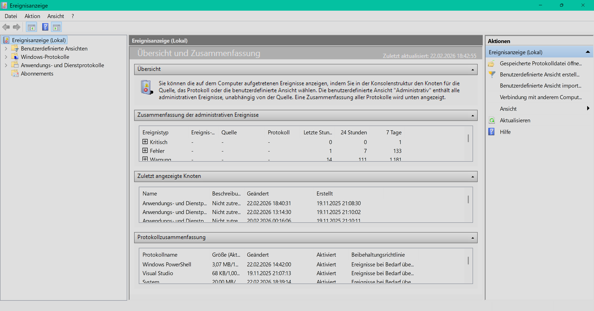
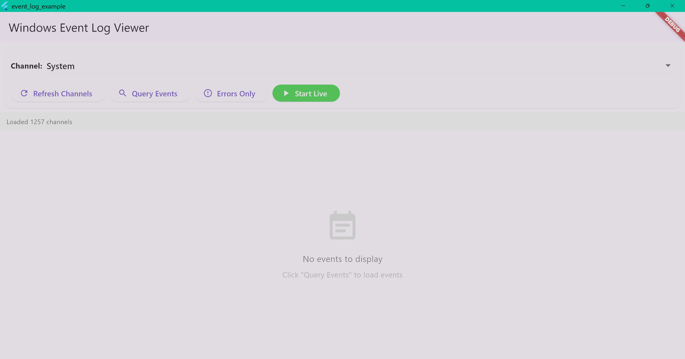

# event_log

<p align="center">
  <kbd>  </kbd>
</p>
<br>
<p align="center">
  
  
  
  
</p>

<p align="center">
  <strong>A comprehensive Flutter plugin for accessing the Windows Event Log (Event Viewer)</strong><br>
  Monitor system events in real-time, query historical events, and manage event subscriptions across Windows Event Log channels with native Win32 integration.
</p>

## 📸 Demo

<p align="center">
  <kbd>  </kbd>
  <br>
  <em>Real-time event monitoring and historical queries in action</em>
</p>

## ✨ Features

🎯 **Real-time Event Monitoring** - Subscribe to live events as they occur
📊 **Historical Event Queries** - Search past events with powerful filtering
🔍 **Event Retrieval by ID** - Get specific events by their record ID
📝 **Channel Management** - List and inspect all event log channels
🎨 **Advanced Filtering** - Filter by level, time range, event ID, provider, and more
⚡ **High Performance** - Efficient C++ implementation using Windows Event Log API
🔒 **Type Safe** - Fully typed Dart API with comprehensive error handling

## 📋 Table of Contents

- [Demo](#-demo)
- [Features](#-features)
- [Platform Support](#-platform-support)
- [Installation](#-installation)
- [Quick Start](#-quick-start)
- [Usage Examples](#-usage-examples)
- [API Reference](#-event-properties)
- [Example App](#-example-app)
- [Contributing](#contributing)
- [License](#license)

## 🖥️ Platform Support

| Platform | Support |
|----------|---------|
| Windows  | ✅      |
| Linux    | ❌      |
| macOS    | ❌      |
| Android  | ❌      |
| iOS      | ❌      |

## 📦 Installation

Add this to your package's `pubspec.yaml` file:

```yaml
dependencies:
  event_log: ^1.0.0
```

Then run:

```bash
flutter pub get
```

## 🚀 Quick Start

Get up and running in 3 simple steps:

### 1️⃣ Import the package

```dart
import 'package:event_log/event_log.dart';
```

### 2️⃣ Query events

```dart
final events = await EventLog.query(
  const EventFilter(channel: 'System', maxEvents: 10),
);
```

### 3️⃣ Subscribe to live events

```dart
final subscription = await EventLog.subscribe(
  const EventFilter(channel: 'System'),
);
subscription.listen((event) => print('🔔 ${event.message}'));
```

---

## 📚 Usage Examples

### 📋 List Available Channels

```dart

// Get all available event log channels
final channels = await EventLog.listChannels();
for (final channel in channels) {
  print('${channel.name}: ${channel.enabled ? "Enabled" : "Disabled"}');
}
```

### 📊 Query Historical Events

```dart
// Query the last 100 events from the System channel
final events = await EventLog.query(
  const EventFilter(
    channel: 'System',
    maxEvents: 100,
    reverse: true, // Most recent first
  ),
);

for (final event in events) {
  print('${event.timeCreated}: Event ${event.eventId} - ${event.level}');
}
```

For Analytic and Debug channels, Windows does not allow reverse-native reads.
If you set `reverse: true`, the plugin automatically queries forward and
reorders the results in memory so your Dart code still receives newest-first
events.

### 🎯 Filter Events by Level

```dart
// Get only errors and critical events
final errorEvents = await EventLog.query(
  EventFilter(
    channel: 'Application',
    levels: [EventLevel.error, EventLevel.critical],
    maxEvents: 50,
  ),
);
```

### ⏰ Filter Events by Time Range

```dart
// Get events from the last 24 hours
final recentEvents = await EventLog.query(
  EventFilter(
    channel: 'System',
    startTime: DateTime.now().subtract(const Duration(hours: 24)),
    endTime: DateTime.now(),
  ),
);
```

### 🔴 Subscribe to Real-time Events

```dart
// Monitor System events in real-time
final subscription = await EventLog.subscribe(
  const EventFilter(channel: 'System'),
);

subscription.listen(
  (event) {
    print('New event: ${event.eventId} - ${event.message}');
  },
  onError: (error) {
    print('Subscription error: $error');
  },
);

// Later: cancel the subscription
await subscription.cancel();
```

### 🔧 Advanced Filtering with XPath

```dart
// Use custom XPath queries for complex filtering
final events = await EventLog.query(
  const EventFilter(
    channel: 'Security',
    xpathQuery: '*[System[(EventID=4624 or EventID=4625) and TimeCreated[@SystemTime>=\'2026-01-01T00:00:00.000Z\']]]',
  ),
);
```

### 🔍 Get Event by ID

```dart
// Retrieve a specific event by its record ID
final event = await EventLog.getById(
  12345,
  channel: 'System', // Optional: specify channel for faster lookup
);

if (event != null) {
  print('Found event: ${event.providerName}');
  print('Message: ${event.message}');
  print('Time: ${event.timeCreated}');
}
```

### ℹ️ Get Channel Information

```dart
// Get detailed information about a channel
final channelInfo = await EventLog.getChannelInfo('System');
if (channelInfo != null) {
  print('Channel: ${channelInfo.name}');
  print('Type: ${channelInfo.type}');
  print('Enabled: ${channelInfo.enabled}');
  print('Log Path: ${channelInfo.logFilePath}');
}
```

### 🗑️ Clear Channel Events

> **⚠️ Requires Administrator Privileges**

```dart
// Clear all events from a channel
try {
  await EventLog.clear(
    'Application',
    backupPath: r'C:\Backups\app_events.evtx', // Optional: backup before clearing
  );
  print('Channel cleared successfully');
} on AccessDeniedException {
  print('Access denied: Administrator privileges required');
} on ChannelNotFoundException {
  print('Channel not found');
}
```

---

## 📖 API Reference

### Event Properties

Each `EventRecord` contains comprehensive event information:

```dart
class EventRecord {
  final int eventRecordId;        // Unique event record ID
  final int eventId;              // Event identifier
  final EventLevel level;         // Severity level
  final DateTime timeCreated;     // Timestamp
  final String channel;           // Channel name
  final String computer;          // Computer name
  final String providerName;      // Event provider
  final String? providerGuid;     // Provider GUID
  final int? task;                // Task category
  final int? opcode;              // Operation code
  final int? keywords;            // Keywords bitmask
  final int? processId;           // Process ID
  final int? threadId;            // Thread ID
  final String? userId;           // User SID
  final String? activityId;       // Activity correlation ID
  final String? message;          // Formatted message
  final String? xml;              // Event as XML
  final Map<String, dynamic>? eventData;  // Event-specific data
}
```

### Event Levels

```dart
enum EventLevel {
  critical,      // Level 1
  error,         // Level 2
  warning,       // Level 3
  information,   // Level 4
  verbose,       // Level 5
  logAlways,     // Level 0
}
```

### Common Channels

- **System** - System events (hardware, drivers, OS)
- **Application** - Application events
- **Security** - Security audit events (requires admin for read access)
- **Setup** - Setup and deployment events
- **Windows PowerShell** - PowerShell events
- **Microsoft-Windows-*** - Various Windows component logs

### Error Handling

The plugin provides specific exception types:

```dart
try {
  final events = await EventLog.query(filter);
} on AccessDeniedException catch (e) {
  print('Access denied: ${e.message}');
} on ChannelNotFoundException catch (e) {
  print('Channel not found: ${e.message}');
} on InvalidQueryException catch (e) {
  print('Invalid query: ${e.message}');
} on UnsupportedChannelException catch (e) {
  print('Unsupported channel operation: ${e.message}');
} on EventLogException catch (e) {
  print('Event log error: ${e.message}');
}
```

`UnsupportedChannelException` is raised when Windows rejects the requested
operation for that channel, such as attempting a live subscription on an
Analytic or Debug log.

Live subscriptions are supported for Admin and Operational channels. Analytic
and Debug channels are the specific channel types that do not support live
subscriptions through the Windows Event Log subscription API.

---

## ⚡ Performance Considerations

- **Channel-specific queries** are faster than cross-channel queries
- **XPath queries** with specific filters are more efficient than wildcard queries
- **Subscriptions** use Windows Event Log's native callbacks for optimal performance
- **Limit maxEvents** to avoid loading excessive data
- **Time range filters** help narrow down results

## 🔐 Permissions

- **Basic queries** - Standard user privileges
- **Security channel** - Often requires administrator privileges
- **Clear channel** - Requires administrator privileges
- **Some subscriptions** - May require elevated privileges depending on the channel
- **Live subscriptions** - Supported for Admin and Operational channels
- **Analytic and Debug channels** - Historical queries are forward-only at the Windows API layer. The plugin transparently emulates `reverse: true` for queries, but live subscriptions are not supported by the Windows Event Log subscription API and will throw `UnsupportedChannelException`

## 💻 Example App

Run the example app to see all features in action:

```bash
cd example
flutter run -d windows
```

### 🎨 Example App Features

- ✅ **Channel Browser** - Browse and select from all system channels
- ✅ **Historical Queries** - Query past events with filtering
- ✅ **Event Filtering** - Filter by severity level (errors only, warnings, etc.)
- ✅ **Live Monitoring** - Subscribe to real-time events with visual indicators
- ✅ **Event Details** - Expandable cards showing all event properties
- ✅ **Material Design 3** - Beautiful, modern UI

## 🛠️ Development

Install the repository-managed Git hooks to auto-format staged Dart and C/C++
files before each commit:

```powershell
pwsh -File scripts/install-git-hooks.ps1
```

The pre-commit hook runs:

- `dart format` for staged `.dart` files
- `clang-format -i` for staged C/C++ source and header files

To format every tracked Dart and C/C++ file in the repository once:

```powershell
pwsh -File scripts/format_all.ps1
```

## 🏗️ Architecture

The plugin uses:
- **Dart Layer**: Clean API with Stream support and Flutter integration
- **Platform Interface**: Pluggable architecture for future platform support
- **Windows C++**: Native implementation using Windows Event Log API (winevt.h)
- **Method Channels**: For synchronous operations (queries, channel info)
- **Event Channels**: For asynchronous event streaming (subscriptions)

## 🔌 Windows Event Log API

This plugin wraps the following Windows APIs:
- `EvtQuery` - Query historical events
- `EvtSubscribe` - Subscribe to live events
- `EvtNext` - Iterate through events
- `EvtRender` - Render event data
- `EvtOpenChannelEnum` - Enumerate channels
- `EvtClearLog` - Clear channel events

## 🤝 Contributing

Contributions are welcome! Here's how you can help:

1. 🐛 **Report bugs** - Open an issue with details
2. 💡 **Suggest features** - Share your ideas
3. 🔧 **Submit PRs** - Fix bugs or add features
4. 📖 **Improve docs** - Help others understand the plugin

Please read our [Contributing Guidelines](CONTRIBUTING.md) before submitting PRs.

## 📄 License

Copyright © 2026 Kaan Gönüldinc

Licensed under the Apache License, Version 2.0 (the "License");
you may not use this file except in compliance with the License.
You may obtain a copy of the License at

    http://www.apache.org/licenses/LICENSE-2.0

Unless required by applicable law or agreed to in writing, software
distributed under the License is distributed on an "AS IS" BASIS,
WITHOUT WARRANTIES OR CONDITIONS OF ANY KIND, either express or implied.
See the License for the specific language governing permissions and
limitations under the License.

See [LICENSE](LICENSE) for more details.
